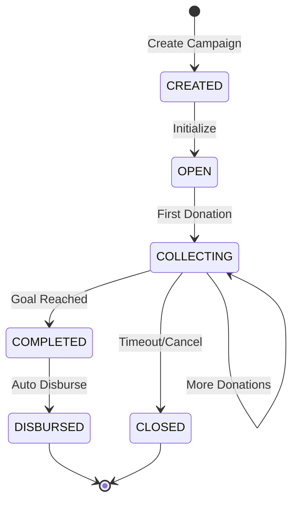
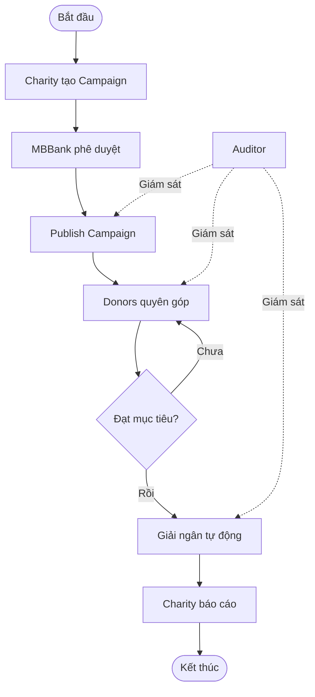
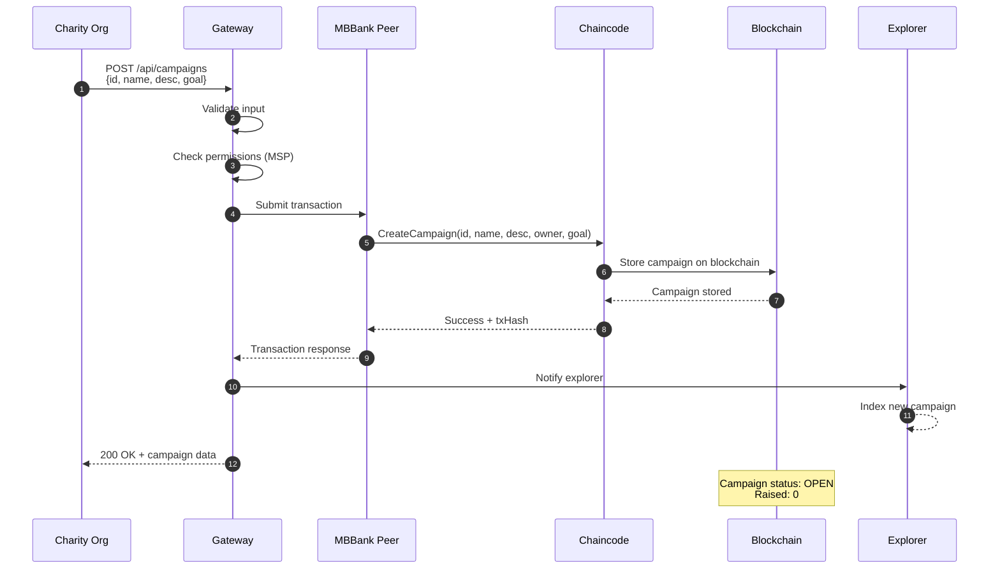
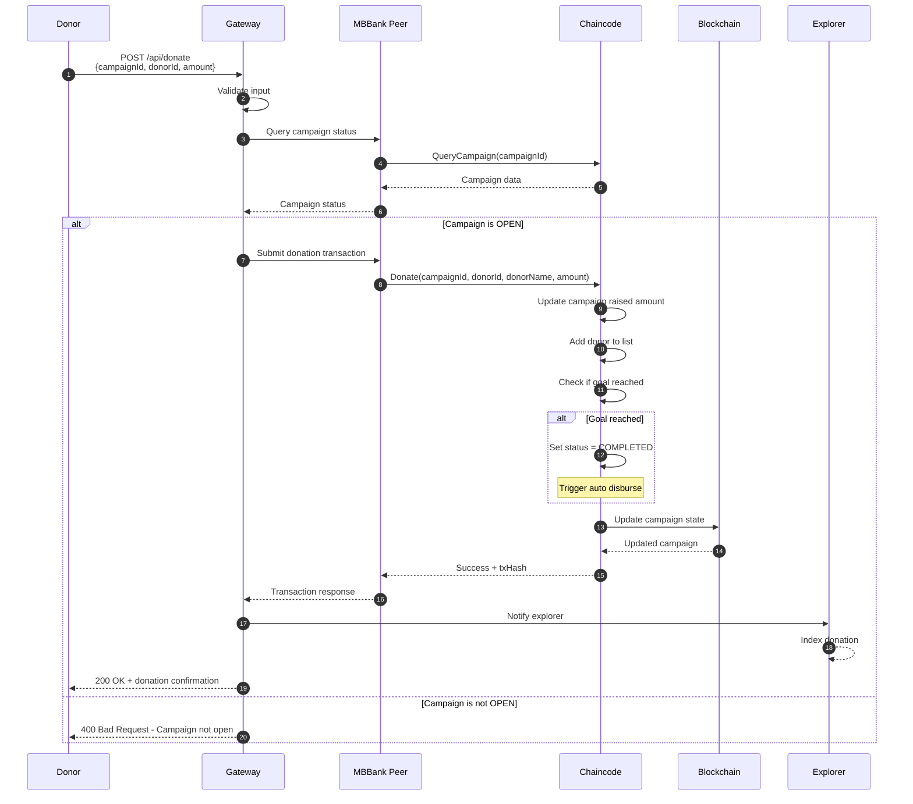
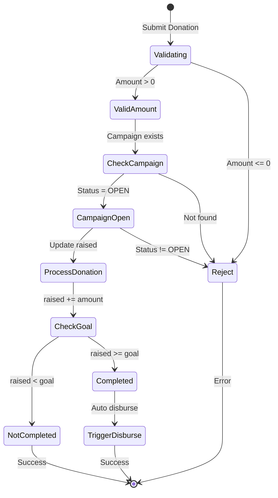
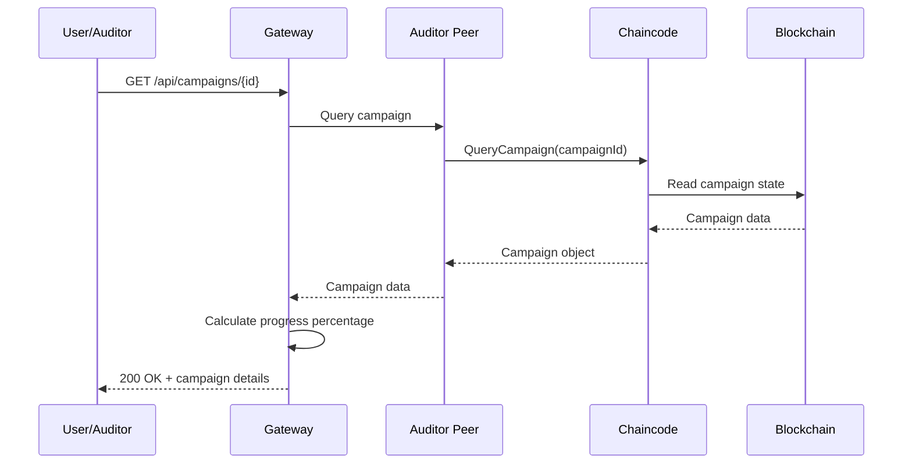
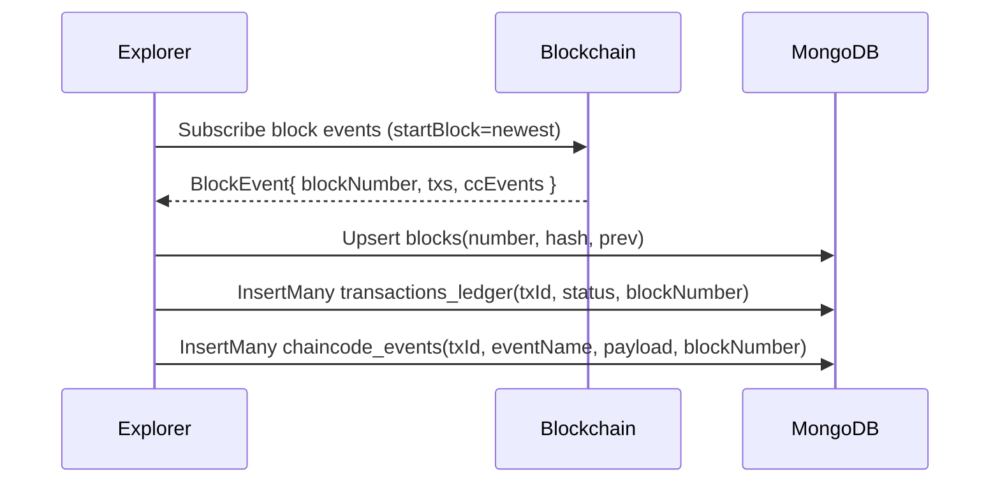
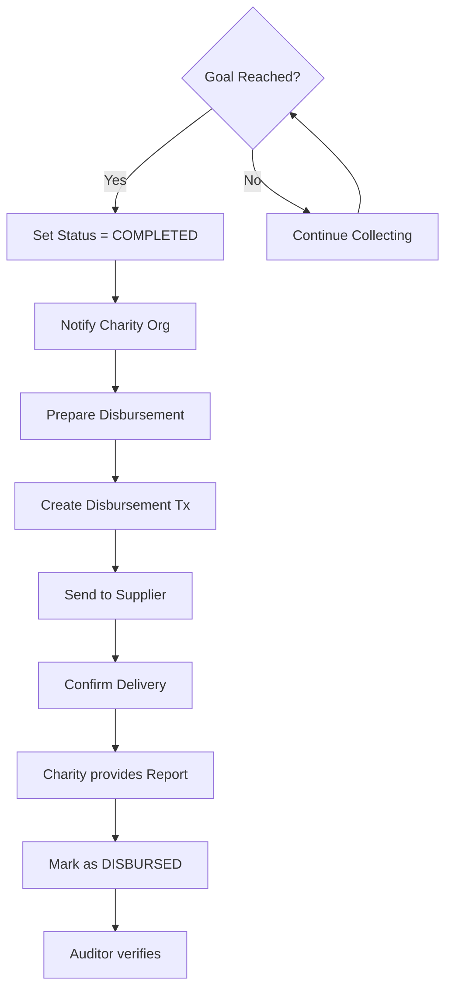
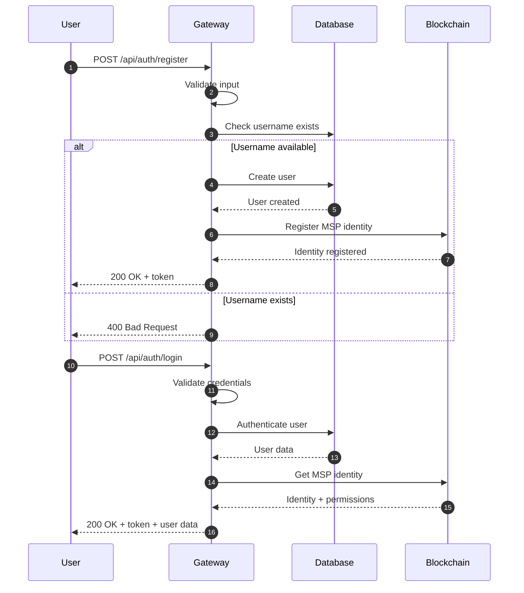

# Thiết kế Chi tiết Luồng Nghiệp vụ & API - KindLedger

## Mục lục

1. [Tổng quan Luồng Nghiệp vụ](#1-tổng-quan-luồng-nghiệp-vụ)
2. [Luồng Tạo Campaign](#2-luồng-tạo-campaign)
3. [Luồng Quyên góp (Donation)](#3-luồng-quyên-góp-donation)
4. [Luồng Theo dõi & Giải ngân](#4-luồng-theo-dõi--giải-ngân)
5. [Authentication & Authorization Flow](#5-authentication--authorization-flow)
6. [API Specifications](#6-api-specifications)
7. [Data Models](#7-data-models)
8. [Error Handling](#8-error-handling)
9. [Security Considerations](#9-security-considerations)

---

## 1. Tổng quan Luồng Nghiệp vụ

### 1.1 Actors trong Hệ thống

```
┌─────────────────────────────────────────────────────────────┐
│                        Actors                                │
├─────────────────────────────────────────────────────────────┤
│ 1. Donor (Người quyên góp)                                  │
│    - Có thể ẩn danh                                         │
│    - Quyên góp cho campaigns                                │
│    - Xem tiến độ quyên góp                                  │
│                                                              │
│ 2. Charity Organization (Tổ chức từ thiện)                  │
│    - Tạo và quản lý campaigns                               │
│    - Nhận giải ngân                                         │
│    - Cung cấp báo cáo                                       │
│                                                              │
│ 3. MBBank (Ngân hàng)                                       │
│    - Anchor organization                                    │
│    - Xử lý quyên góp                                        │
│    - Giải ngân tự động                                       │
│                                                              │
│ 4. Supplier (Nhà cung cấp)                                  │
│    - Cung cấp sản phẩm/dịch vụ                              │
│    - Tham gia quá trình giải ngân                           │
│                                                              │
│ 5. Auditor (Giám sát)                                       │
│    - Read-only access                                       │
│    - Giám sát real-time                                     │
│    - Audit trail                                            │
└─────────────────────────────────────────────────────────────┘
```

### 1.2 Vòng đời Campaign



### 1.3 Luồng Tổng thể



---

## 2. Luồng Tạo Campaign

### 2.1 Chi tiết Luồng



### 2.2 API Specification

#### POST /api/campaigns

**Description**: Tạo chiến dịch quyên góp mới

**Request Headers**:
```
Authorization: Bearer {token}
Content-Type: application/json
```

**Request Body**:
```json
{
  "id": "string (required, unique)",
  "name": "string (required, max 200 chars)",
  "description": "string (optional, max 5000 chars)",
  "owner": "string (required, charity org ID)",
  "goal": "number (required, > 0)"
}
```

**Response**: 200 OK
```json
{
  "success": true,
  "message": "Campaign created successfully on blockchain",
  "data": {
    "id": "campaign-001",
    "name": "Support Poor Children",
    "description": "Help poor children in rural areas",
    "owner": "charity-org-001",
    "goal": 10000000,
    "raised": 0,
    "status": "OPEN",
    "createdAt": "2025-10-28T10:00:00Z",
    "updatedAt": "2025-10-28T10:00:00Z",
    "donors": []
  }
}
```

**Error Responses**:

| Status | Description |
|--------|-------------|
| 400 | Bad Request - Invalid input |
| 401 | Unauthorized - Missing/invalid token |
| 403 | Forbidden - Insufficient permissions |
| 409 | Conflict - Campaign ID already exists |
| 500 | Internal Server Error |

### 2.3 Validation Rules

- **ID**: Must be unique, alphanumeric, max 100 chars
- **Name**: Required, max 200 chars
- **Description**: Optional, max 5000 chars
- **Goal**: Required, must be positive number
- **Owner**: Must be valid organization ID with CharityMSP

### 2.4 Blockchain Transaction

**Chaincode Function**: `CreateCampaign`

**Parameters**:
- `id` (string): Campaign identifier
- `name` (string): Campaign name
- `description` (string): Campaign description
- `owner` (string): Charity organization ID
- `goal` (float64): Fundraising goal amount

**Returns**: Campaign object

**Side Effects**:
- Creates new campaign in blockchain state
- Sets initial status to "OPEN"
- Sets raised amount to 0
- Initializes empty donors array
- Timestamp created/updated

---

## 3. Luồng Quyên góp (Donation)

### 3.1 Chi tiết Luồng



### 3.2 API Specification

#### POST /api/donate

**Description**: Thực hiện quyên góp cho campaign

**Request Headers**:
```
Content-Type: application/json
```

**Request Body**:
```json
{
  "campaignId": "string (required)",
  "donorId": "string (optional, for anonymous donation)",
  "donorName": "string (optional, for anonymous donation)",
  "amount": "number (required, > 0)"
}
```

**Response**: 200 OK
```json
{
  "success": true,
  "message": "Donation processed successfully on blockchain",
  "data": {
    "campaignId": "campaign-001",
    "donorId": "donor-123",
    "donorName": "Nguyen Van A",
    "amount": 500000,
    "timestamp": "2025-10-28T11:00:00Z"
  },
  "campaign": {
    "id": "campaign-001",
    "name": "Support Poor Children",
    "raised": 500000,
    "goal": 10000000,
    "status": "OPEN",
    "progress": 5.0
  }
}
```

**Error Responses**:

| Status | Description |
|--------|-------------|
| 400 | Bad Request - Invalid amount or campaign not found |
| 409 | Conflict - Campaign not open for donations |
| 500 | Internal Server Error |

### 3.3 Validation Rules

- **campaignId**: Must exist and status = OPEN
- **amount**: Must be positive number, minimum 1
- **donorId**: Optional for anonymous donations
- **donorName**: Optional for anonymous donations

### 3.4 Business Logic

1. **Check Campaign Status**: Only OPEN campaigns accept donations
2. **Update Raised Amount**: Add donation to current raised amount
3. **Add Donor**: Record donor information in campaign donors list
4. **Check Goal**: If raised >= goal, set status to COMPLETED
5. **Trigger Actions**: If completed, trigger auto-disburse flow
6. **Return Updated Campaign**: Return current campaign state

### 3.5 Donation State Machine



---

## 4. Luồng Theo dõi & Giải ngân

### 4.1 Query Campaign Status



### 4.1.1 Explorer -> Mongo Ledger Flow (Read Only)



Nguyên tắc bất biến:
- Chỉ Explorer ghi 3 collection: `blocks`, `transactions_ledger`, `chaincode_events`.
- Ghi idempotent, không cập nhật/xóa.
- Gateway/Frontend chỉ đọc qua các API Explorer.

Endpoint Explorer (đọc từ Mongo):
- GET `/api/blockchain/info` → tính height từ `blocks` (max(number)+1)
- GET `/api/blocks?limit=N` → đọc `blocks` sort number desc
- Tương lai: GET `/api/tx/{txId}` → đọc `transactions_ledger` và sự kiện liên quan

#### GET /api/campaigns/{id}

**Description**: Lấy thông tin chi tiết của campaign

**Response**: 200 OK
```json
{
  "success": true,
  "message": "Campaign retrieved successfully",
  "data": {
    "id": "campaign-001",
    "name": "Support Poor Children",
    "description": "Help poor children in rural areas",
    "owner": "charity-org-001",
    "goal": 10000000,
    "raised": 7500000,
    "status": "OPEN",
    "createdAt": "2025-10-28T10:00:00Z",
    "updatedAt": "2025-10-28T14:30:00Z",
    "donors": [
      {
        "id": "donor-123",
        "name": "Nguyen Van A",
        "amount": 500000,
        "donatedAt": "2025-10-28T11:00:00Z"
      }
    ],
    "progress": 75.0,
    "remaining": 2500000
  }
}
```

### 4.2 Get All Campaigns

#### GET /api/campaigns

**Description**: Lấy danh sách tất cả campaigns

**Query Parameters**:
- `status` (optional): Filter by status (OPEN, COMPLETED, CLOSED)
- `owner` (optional): Filter by owner organization
- `page` (optional): Page number (default: 1)
- `limit` (optional): Items per page (default: 10)

**Response**: 200 OK
```json
{
  "success": true,
  "message": "Campaigns retrieved successfully",
  "data": [
    {
      "id": "campaign-001",
      "name": "Support Poor Children",
      "goal": 10000000,
      "raised": 7500000,
      "status": "OPEN",
      "progress": 75.0,
      "createdAt": "2025-10-28T10:00:00Z"
    }
  ],
  "pagination": {
    "page": 1,
    "limit": 10,
    "total": 50,
    "totalPages": 5
  }
}
```

### 4.3 Get Total Donations

#### GET /api/stats/total

**Description**: Lấy tổng số tiền đã quyên góp

**Response**: 200 OK
```json
{
  "success": true,
  "message": "Total donations retrieved successfully",
  "data": 150000000
}
```

### 4.4 Auto Disburse Flow



---

## 5. Authentication & Authorization Flow

### 5.1 User Registration & Login



### 5.2 API Specifications

#### POST /api/auth/register

**Request Body**:
```json
{
  "username": "string (required, unique)",
  "email": "string (required, valid email)",
  "password": "string (required, min 8 chars)",
  "fullName": "string (required)"
}
```

**Response**: 200 OK
```json
{
  "success": true,
  "message": "User registered successfully",
  "data": {
    "token": "Bearer eyJhbGc...",
    "userId": "user-123",
    "username": "johndoe",
    "email": "john@example.com",
    "fullName": "John Doe",
    "role": "USER"
  }
}
```

#### POST /api/auth/login

**Request Body**:
```json
{
  "username": "string (required)",
  "password": "string (required)"
}
```

**Response**: 200 OK
```json
{
  "success": true,
  "message": "Login successful",
  "data": {
    "token": "Bearer eyJhbGc...",
    "userId": "user-123",
    "username": "johndoe",
    "email": "john@example.com",
    "fullName": "John Doe",
    "role": "USER"
  }
}
```

#### GET /api/auth/me

**Request Headers**:
```
Authorization: Bearer {token}
```

**Response**: 200 OK
```json
{
  "success": true,
  "data": {
    "id": "user-123",
    "username": "johndoe",
    "email": "john@example.com",
    "fullName": "John Doe",
    "role": "USER",
    "organizations": ["MBBankMSP"]
  }
}
```

### 5.3 MSP-based Authorization

**Roles & Permissions**:

| Role | MSP | Permissions |
|------|-----|-------------|
| MBBank Admin | MBBankMSP | Create campaigns, process donations, disburse funds |
| Charity Member | CharityMSP | Create campaigns, view own campaigns |
| Donor | Public | Donate, view campaigns |
| Supplier | SupplierMSP | View campaigns, confirm delivery |
| Auditor | AuditorMSP | Read-only access to all data |

---

## 6. API Specifications

### 6.1 Base URL

```
Production: https://api.kindledger.com/api
Development: http://localhost:8080/api
```

### 6.2 API Endpoints Summary

| Method | Endpoint | Description | Auth Required |
|--------|----------|-------------|---------------|
| GET | `/health` | Health check | No |
| POST | `/auth/register` | User registration | No |
| POST | `/auth/login` | User login | No |
| GET | `/auth/me` | Get current user | Yes |
| GET | `/campaigns` | List campaigns | No |
| POST | `/campaigns` | Create campaign | Yes (CharityMSP) |
| GET | `/campaigns/{id}` | Get campaign details | No |
| POST | `/donate` | Make donation | No |
| GET | `/stats/total` | Total donations | No |
| POST | `/init` | Initialize ledger | Yes (Admin) |

### 6.3 Common Response Format

**Success Response**:
```json
{
  "success": true,
  "message": "Operation successful",
  "data": {}
}
```

**Error Response**:
```json
{
  "success": false,
  "message": "Error description",
  "error": "Error details (optional)"
}
```

---

## 7. Data Models

### 7.1 Campaign Model

```typescript
interface Campaign {
  id: string;                    // Unique campaign identifier
  name: string;                  // Campaign name (max 200 chars)
  description: string;           // Campaign description (max 5000 chars)
  owner: string;                 // Charity organization ID
  goal: number;                  // Fundraising goal amount
  raised: number;                // Amount raised so far
  status: CampaignStatus;        // OPEN | COMPLETED | CLOSED | DISBURSED
  createdAt: string;             // ISO 8601 timestamp
  updatedAt: string;             // ISO 8601 timestamp
  donors: Donor[];               // List of donors
}

enum CampaignStatus {
  OPEN = "OPEN",
  COMPLETED = "COMPLETED",
  CLOSED = "CLOSED",
  DISBURSED = "DISBURSED"
}
```

### 7.2 Donor Model

```typescript
interface Donor {
  id: string;                    // Donor identifier (can be anonymous)
  name: string;                  // Donor name (can be "Anonymous")
  amount: number;                // Donation amount
  donatedAt: string;             // ISO 8601 timestamp
}
```

### 7.3 User Model

```typescript
interface User {
  id: string;                    // User ID
  username: string;              // Unique username
  email: string;                 // Email address
  fullName: string;              // Full name
  role: UserRole;                // USER | ADMIN | CHARITY | SUPPLIER | AUDITOR
  organizations: string[];       // MSP organizations
  createdAt: string;             // ISO 8601 timestamp
}

enum UserRole {
  USER = "USER",
  ADMIN = "ADMIN",
  CHARITY = "CHARITY",
  SUPPLIER = "SUPPLIER",
  AUDITOR = "AUDITOR"
}
```

### 7.4 Transaction Model

```typescript
interface Transaction {
  txId: string;                  // Transaction ID
  campaignId: string;            // Campaign ID
  type: TransactionType;         // CREATE | DONATE | DISBURSE
  amount: number;                // Transaction amount
  timestamp: string;             // ISO 8601 timestamp
  status: TransactionStatus;     // PENDING | CONFIRMED | FAILED
  blockNumber: number;           // Block number
}

enum TransactionType {
  CREATE = "CREATE",
  DONATE = "DONATE",
  DISBURSE = "DISBURSE"
}
```

---

## 8. Error Handling

### 8.1 Error Codes

| Status Code | Description | Examples |
|-------------|-------------|----------|
| 200 | Success | Successful operation |
| 400 | Bad Request | Invalid input, validation errors |
| 401 | Unauthorized | Missing/invalid authentication token |
| 403 | Forbidden | Insufficient permissions |
| 404 | Not Found | Resource not found |
| 409 | Conflict | Duplicate ID, resource already exists |
| 500 | Internal Server Error | Server error, blockchain error |
| 503 | Service Unavailable | Blockchain network unavailable |

### 8.2 Error Response Structure

```json
{
  "success": false,
  "error": "ERROR_CODE",
  "message": "Human-readable error message",
  "details": {
    "field": "Validation error details",
    "timestamp": "2025-10-28T10: LE:00Z",
    "requestId": "req-123-456-789"
  }
}
```

### 8.3 Common Errors

#### Validation Errors (400)

```json
{
  "success": false,
  "error": "VALIDATION_ERROR",
  "message": "Campaign name is required",
  "details": {
    "field": "name",
    "code": "REQUIRED"
  }
}
```

#### Unauthorized (401)

```json
{
  "success": false,
  "error": "UNAUTHORIZED",
  "message": "Authentication required"
}
```

#### Forbidden (403)

```json
{
  "success": false,
  "error": "FORBIDDEN",
  "message": "Insufficient permissions to create campaign"
}
```

#### Not Found (404)

```json
{
  "success": false,
  "error": "NOT_FOUND",
  "message": "Campaign with ID 'campaign-999' not found"
}
```

#### Conflict (409)

```json
{
  "success": false,
  "error": "CONFLICT",
  "message": "Campaign with ID 'campaign-001' already exists"
}
```

#### Blockchain Error (500)

```json
{
  "success": false,
  "error": "BLOCKCHAIN_ERROR",
  "message": "Transaction failed on blockchain",
  "details": {
    "txHash": "0xabc...",
    "reason": "Network unavailable"
  }
}
```

---

## 9. Security Considerations

### 9.1 Authentication

- **JWT Tokens**: Stateless authentication tokens
- **Token Expiry**: 24 hours
- **Token Refresh**: Refresh token mechanism
- **Bearer Auth**: Authorization header with Bearer token

### 9.2 Authorization

- **MSP-based**: Hyperledger Fabric MSP identity management
- **Role-based Access Control (RBAC)**: Different roles with different permissions
- **Policy Enforcement**: Chaincode-level policy enforcement

### 9.3 Input Validation

- **Request Validation**: All inputs validated before processing
- **Sanitization**: XSS and SQL injection prevention
- **Type Checking**: Strong type validation
- **Boundary Checks**: Min/max value validation

### 9.4 Data Privacy

- **Anonymous Donations**: Support for anonymous donor information
- **PII Protection**: Personal identifiable information encrypted
- **Access Control**: Limited access to sensitive data
- **Audit Trail**: Complete transaction history for auditing

### 9.5 API Security Best Practices

1. **Rate Limiting**: Prevent API abuse
2. **CORS Configuration**: Control cross-origin requests
3. **HTTPS Only**: TLS/SSL encryption in production
4. **Request Timeout**: Prevent long-running requests
5. **Input Validation**: Validate all inputs
6. **Output Encoding**: Prevent XSS attacks
7. **Error Handling**: Don't expose internal errors
8. **Logging**: Comprehensive security logging

---

## 10. Performance & Scalability

### 10.1 Performance Metrics

| Operation | Target Response Time | Throughput |
|-----------|---------------------|------------|
| Create Campaign | < 3 seconds | 50 ops/sec |
| Make Donation | < 2 seconds | 100 ops/sec |
| Query Campaign | < 500ms | 500 ops/sec |
| Get All Campaigns | < 1 second | 200 ops/sec |

### 10.2 Optimization Strategies

1. **Caching**: Cache frequently accessed data
2. **Connection Pooling**: Optimize database connections
3. **Async Processing**: Process donations asynchronously
4. **Load Balancing**: Distribute load across peers
5. **Indexing**: Optimize blockchain queries

### 10.3 Scalability Considerations

- **Horizontal Scaling**: Add more peer nodes
- **Sharding**: Partition campaigns by region or type
- **Data Archiving**: Archive old campaigns
- **CDN**: Use CDN for static content

---

## 11. Testing Strategies

### 11.1 Unit Tests

- Test individual API endpoints
- Mock blockchain interactions
- Test validation logic

### 11.2 Integration Tests

- Test API Gateway with Fabric network
- Test end-to-end workflows
- Test error handling

### 11.3 Performance Tests

- Load testing for donation processing
- Stress testing for peak traffic
- Benchmark campaign queries

---

**Last Updated**: 2025-10-28  
**Version**: 1.0  
**Author**: KindLedger Team
