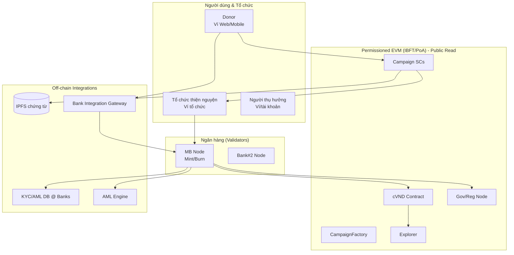
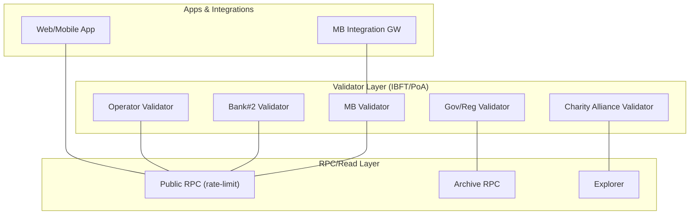
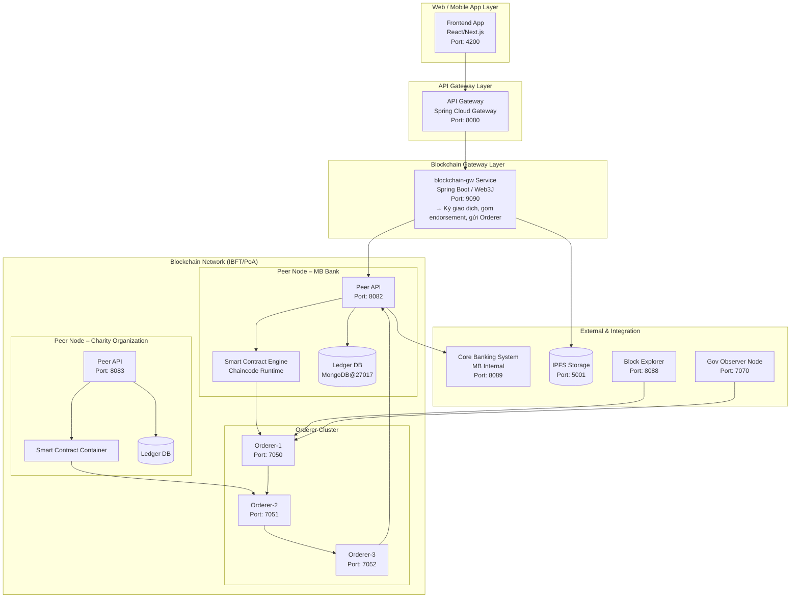
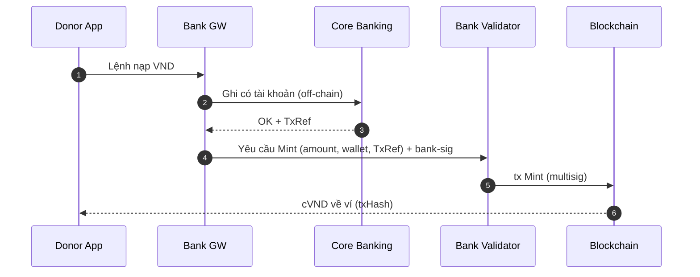
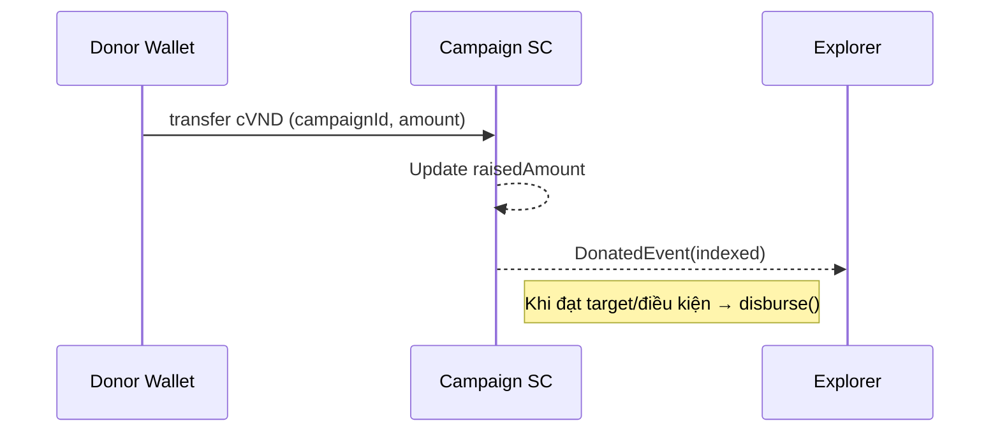
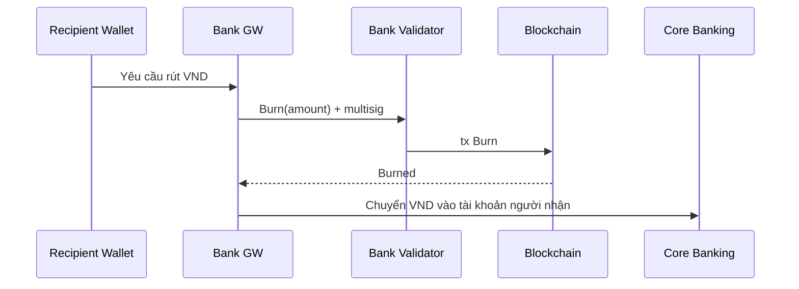

# KindLedger — Hệ thống chuyển tiền thiện nguyện token hóa (Bank‑as‑Node)

---

## 0) Tóm tắt điều hành

- **Mục tiêu**: Minh bạch tuyệt đối hành trình tiền từ thiện thông qua token đại diện VND (cVND); mọi giao dịch on‑chain; nạp/rút qua ngân hàng.
- **Mô hình**: Permissioned, public‑read EVM chain (IBFT/PoA). Mỗi ngân hàng = 1 validator node; Chính phủ & Liên minh Tổ chức Thiện nguyện có node giám sát/validator.
- **Dòng tiền**: Nạp VND → Mint cVND (1:1) → Donate/giải ngân bằng token → Rút VND → Burn cVND.
- **Minh bạch & riêng tư**: Explorer công khai (ai cũng xem được token đi đâu); danh tính donor pseudonymous; mapping wallet↔account do ngân hàng quản lý off‑chain (KYC/AML).
- **POC**: 3 tháng, 5 validators (MB, Bank#2, Gov, Charity Alliance, Operator).

---

## 1) Bài toán & Mục tiêu

**Bài toán**: Data center tập trung tạo điểm yếu: thiếu minh bạch, báo cáo hậu kiểm, khó truy vết, chi phí đối soát cao, phụ thuộc niềm tin vào một đơn vị.

**Mục tiêu**:
- **Minh bạch**: Theo vết token từ donor → campaign → beneficiary theo thời gian thực.
- **Tin cậy/bất biến**: Sổ cái phân tán, không thể sửa.
- **Tuân thủ**: KYC/AML tại ngân hàng; cơ quan quản lý có node giám sát.
- **Hiệu quả/chi phí**: Tự động hóa giải ngân/hoàn, giảm đối soát/giấy tờ.

---

## 2) Phạm vi & Vai trò

**Phạm vi POC**: 1–3 campaigns, 2 ngân hàng (MB + 1 bank), 1 tổ chức thiện nguyện lớn, 1 gov/observer, tối thiểu 2.000 users.

**Vai trò**:
- **Ngân hàng (validators)**: Mint/Burn cVND; tích hợp Core Banking; KYC/AML; vận hành node.
- **Tổ chức thiện nguyện (validator/observer)**: Tạo campaign, nhận giải ngân, cung cấp chứng từ IPFS.
- **Chính phủ/cơ quan giám sát (observer/validator)**: Giám sát real‑time, audit.
- **Người dùng (donor/beneficiary)**: Donate/nhận tiền; có thể ẩn danh ở mức ví.

---

## 3) So sánh Blockchain (token hóa) vs Data Center

| Tiêu chí | Blockchain (KindLedger) | Data Center truyền thống |
|----------|-------------------------|---------------------------|
| Minh bạch | Explorer công khai, theo vết từng token/tx | Báo cáo nội bộ, khó kiểm chứng độc lập |
| Tin cậy | Bất biến, đa bên xác thực (banks+gov+charities) | Tập trung, 1 bên kiểm soát |
| Giám sát pháp lý | Gov node realtime, log bất biến | Kiểm toán hậu kiểm, độ trễ cao |
| Vận hành | Smart contract tự động hóa | Thủ công, đối soát phức tạp |
| Chi phí dài hạn | Giảm trung gian, chuẩn hóa liên thông | Tăng theo quy mô, tích hợp manh mún |

---

## 4) Kiến trúc tổng thể

### 4.1 Sơ đồ bối cảnh



### 4.2 Mạng & Topology



**POC**: 5 validators. **Prod**: 10–20 validators, đa ngân hàng & tổ chức.

### 4.3 Kiến trúc chi tiết hệ thống



---

## 5) Mô hình Token & Dòng tiền

### 5.1 Token cVND

- **Tên**: Charity Vietnamese Đồng (cVND), Peg: 1 cVND = 1 VND (dự trữ 100% tại ngân hàng).
- **Chuẩn**: ERC‑20 + EIP‑2612 (permit), optional EIP‑3009.
- **Quyền**: MINTER_ROLE (multisig ngân hàng), FREEZER_ROLE (gov+bank), PAUSER_ROLE.

### 5.2 Dòng tiền (sequence)

**Nạp VND → Mint cVND**



**Donate → Disburse**



**Redeem → Burn**



---

## 6) Thiết kế Smart Contract (đặc tả & pseudocode)

### 6.1 Đặc tả chức năng

- **cVND (ERC‑20 mở rộng)**: mint/burn (multisig), freeze/unfreeze, pause/unpause, hooks tuân thủ AML, events Minted/Burned.
- **CampaignFactory**: tạo campaign, registry id→address, role admin (owner/multisig alliance).
- **Campaign**: tham số target, deadline, recipient, allowAnonymous; hàm donate(), disburse(), refund(), setEvidence(ipfsHash); events Donated/Disbursed/Refunded.
- **ComplianceHooks**: giới hạn ẩn danh (single/daily), denylist/allowlist KYC; hook trước chuyển token.

### 6.2 Pseudocode (Solidity‑like)

```solidity
// SPDX-License-Identifier: UNLICENSED
pragma solidity ^0.8.20;

abstract contract Roles { bytes32 constant MINTER_ROLE=..., FREEZER_ROLE=..., PAUSER_ROLE=...; function hasRole(bytes32,address) public view virtual returns(bool); }
interface IComplianceHooks{ function beforeTokenTransfer(address,address,uint256) external; }

contract cVND is Roles /* ERC20, ERC20Permit, Pausable, AccessControl */{
  mapping(address=>bool) public frozen; IComplianceHooks public hooks;
  function setHooks(address h) external /* onlyRole(PAUSER_ROLE) */{ hooks=IComplianceHooks(h);} 
  function pause() external /* onlyRole(PAUSER_ROLE) */ {}
  function unpause() external /* onlyRole(PAUSER_ROLE) */ {}
  function freeze(address a) external /* onlyRole(FREEZER_ROLE) */ { frozen[a]=true; }
  function unfreeze(address a) external /* onlyRole(FREEZER_ROLE) */ { frozen[a]=false; }
  function mint(address to,uint256 amt) external /* onlyRole(MINTER_ROLE) */ { emit Minted(to,amt);} 
  function burn(address from,uint256 amt) external /* onlyRole(MINTER_ROLE) */ { emit Burned(from,amt);} 
  function _beforeTokenTransfer(address f,address t,uint256 a) internal { require(!frozen[f]&&!frozen[t],"FROZEN"); if(address(hooks)!=address(0)) hooks.beforeTokenTransfer(f,t,a);} 
  event Minted(address indexed to,uint256 amt); event Burned(address indexed from,uint256 amt);
}

contract ComplianceHooks is IComplianceHooks /* Ownable */{
  uint256 public anonSingleLimit; uint256 public anonDailyLimit;
  mapping(address=>uint256) public spentToday; mapping(address=>uint256) public lastSpendDay; mapping(address=>bool) public kyc;
  constructor(uint256 s,uint256 d){anonSingleLimit=s;anonDailyLimit=d;} function setKyc(address a,bool ok) external /*onlyOwner*/{kyc[a]=ok;}
  function beforeTokenTransfer(address from,address to,uint256 amt) external { if(kyc[from]||kyc[to]) return; require(amt<=anonSingleLimit,"LIMIT_SINGLE"); uint256 day=block.timestamp/1 days; if(lastSpendDay[from]!=day){lastSpendDay[from]=day;spentToday[from]=0;} require(spentToday[from]+amt<=anonDailyLimit,"LIMIT_DAILY"); spentToday[from]+=amt; }
}

contract CampaignFactory /* Ownable */{ mapping(bytes32=>address) public registry; event CampaignCreated(address c,bytes32 id,address r);
  function create(bytes32 id,address token,address recipient,uint256 target,uint256 deadline,bool allowAnon) external /*onlyOwner*/ returns(address c){ require(registry[id]==address(0),"DUP_ID"); c=address(new Campaign(token,recipient,target,deadline,allowAnon)); registry[id]=c; emit CampaignCreated(c,id,recipient);} }

contract Campaign /* ReentrancyGuard */{
  enum Status{Active,Success,Expired,Refunding,Closed}
  address public immutable TOKEN; address public recipient; uint256 public target; uint256 public deadline; bool public allowAnonymous; uint256 public raised; Status public status; bytes32 public evidenceHash;
  event Donated(address indexed from,uint256 amt); event Disbursed(address indexed to,uint256 amt); event Refunded(address indexed to,uint256 amt);
  constructor(address t,address r,uint256 tg,uint256 dl,bool an){TOKEN=t;recipient=r;target=tg;deadline=dl;allowAnonymous=an;status=Status.Active;}
  function donate(uint256 amt) external { require(status==Status.Active && block.timestamp<=deadline, "NOT_ACTIVE"); /* IERC20(TOKEN).transferFrom(msg.sender,address(this),amt); */ raised+=amt; emit Donated(msg.sender,amt); if(raised>=target){ _disburse(); }}
  function _disburse() internal { status=Status.Success; uint256 amt=raised; raised=0; /* IERC20(TOKEN).transfer(recipient,amt); */ emit Disbursed(recipient,amt); }
  function setEvidence(bytes32 ipfs) external /* onlyRecipient */ { evidenceHash=ipfs; }
  function refund(address to,uint256 amt) external /* policy */ { require(status==Status.Expired||status==Status.Refunding,"NO_REFUND"); /* IERC20(TOKEN).transfer(to,amt); */ emit Refunded(to,amt);} }

```

**Audit checklist**: OpenZeppelin ACL, SafeMath (^0.8), reentrancy, event indexation, pausability, multisig (Gnosis Safe) cho MINTER_ROLE & admin; test: Foundry/Hardhat + Slither + Echidna.

---

## 7) Tầng tích hợp & API (Bank GW)

### 7.1 Kiến trúc Integration

- **Bank GW (Spring Boot)**:
- **REST/gRPC**: /mint, /burn, /redeem, /kyc/{wallet}, /evidence.
- **Ký giao dịch on‑chain** qua HSM/KMS; rate‑limit; retry idempotent.
- **Outbox → Kafka**: phát event Minted/Burned/Disbursed cho DWH/BI.
- **Core Banking**: kiểm tra số dư/ghi có/ghi nợ; reconciliation theo TxRef.
- **AML Engine**: rule ẩn danh, sanctions screening; kết quả → ComplianceHooks via admin tx.

### 7.2 API mẫu

```
POST /mint { amount, wallet, txRef } -> 202 Accepted (mintTxHash)
POST /burn { amount, wallet, reason } -> 202 Accepted (burnTxHash)
POST /redeem { amount, wallet, bankAccount } -> 202 Accepted (redeemId)
GET  /kyc/{wallet} -> { status: KYCED|ANON, limits: {...} }
POST /evidence { campaignId, ipfsHash } -> 200 OK
```

---

## 8) Bảo mật, Riêng tư & Pháp lý

### 8.1 Bảo mật

- **Khóa/Chứng thư**: Validator & multisig ký qua HSM/KMS; người dùng hỗ trợ MPC/hardware wallet.
- **Kênh**: TLS/mTLS giữa nodes & GW; RPC public chỉ read‑only + rate‑limit.
- **Quyền**: RBAC, least‑privilege; on‑chain roles tách bạch (minter/freezer/pauser).
- **Dữ liệu**: On‑chain không chứa PII; IPFS lưu chứng từ → chỉ public hash; KYC encrypt‑at‑rest.

### 8.2 Pháp lý & tuân thủ

- **cVND** là đại diện số của VND trong hệ khép kín; mint/burn gắn với nạp/rút qua ngân hàng.
- **KYC/AML** tại ngân hàng; ẩn danh chỉ ở mức ví và theo ngưỡng; redeem bắt buộc KYC.
- **Gov node** giám sát realtime; export báo cáo theo chuẩn kiểm toán.
- **Đề xuất triển khai** trong sandbox Fintech/CSR, có MoU 3 bên (Bank–Charity–Gov).

---

## 9) Vận hành (SRE) & Quan trắc

- **K8s** on‑prem/hybrid; mỗi validator 2–4 vCPU, 4–8GiB RAM, SSD 100–200GiB.
- **Observability**: Prometheus/Grafana; logs Loki/ELK; on‑chain events → Kafka → DWH/BI.
- **SLA**: finality < 5s; uptime validators ≥ 99.9%; RPO=15m, RTO=30m.
- **Backup**: Snapshot state; IPFS pinning đa nút; DR site (cross‑AZ/DC).
- **Game‑day**: Diễn tập freeze/unfreeze, validator failover, fork test, snapshot restore.

---

## 10) Hiệu năng & Mở rộng

- **TPS mục tiêu**: 100–300 tx/s (PoA/IBFT đủ cho use‑case).
- **Độ trễ**: 2–5s/finality.
- **Phí**: ~0 (sidechain); có thể đặt gas‑sponsor cho donate.
- **Mở rộng**: thêm validators; shard theo domain (region/campaign class) nếu cần.

---

## 11) Rủi ro & Giảm thiểu (Risk Register)

| Rủi ro | Ảnh hưởng | Xác suất | Biện pháp |
|--------|-----------|----------|-----------|
| Bug smart contract | Cao | Thấp‑TB | Audit độc lập, timelock, canary, bug bounty |
| Lạm dụng ẩn danh (AML) | Cao | TB | Thresholds, ComplianceHooks, freeze (multisig gov+bank), off‑chain scoring |
| Mất peg dự trữ | Cao | Thấp | Báo cáo dự trữ hằng ngày, audit định kỳ, alert tự động |
| Validator down/fork | TB | Thấp | ≥5 validators, auto‑failover, quorum IBFT, backup/fork‑choice policy |
| Lộ KYC off‑chain | TB | Thấp‑TB | Encrypt‑at‑rest, RBAC, audit trail, DLP |
| Pháp lý chưa rõ | TB | TB | Sandbox Fintech, MoU 3 bên, phạm vi khép kín |
| Chi phí ban đầu | Thấp‑TB | TB | POC nhỏ, tái dùng hạ tầng MB, chuẩn hoá module |

---

## 12) Lộ trình triển khai

| Giai đoạn | Thời gian | Deliverables |
|-----------|-----------|--------------|
| POC | ~3 tháng | 5 validators; cVND+Campaign SC; Explorer; IPFS; MB sandbox mint/burn; dashboard CSR |
| Pilot | +6 tháng | 10–12 validators; AML hooks; public explorer; BI reports; quy trình pháp lý |
| Production | +12 tháng | 15–20 validators; DR; audit độc lập; API mở cộng đồng |

---

## 13) Thông số kỹ thuật (NFR)

- **Bảo mật**: ISO 27001 control mapping; CIS Benchmarks cho K8s; secrets rotation 90 ngày.
- **Tính sẵn sàng**: Multi‑AZ/DC validators; PDB, HPA.
- **Khả năng kiểm toán**: Events đầy đủ, index theo campaignId, txRef, wallet.
- **Khả năng phục hồi**: Snapshot mỗi 6h; test restore hàng tuần.

---

## 14) Phụ lục A — Smart Contract Pseudocode

*(Gần với Solidity 0.8.x; dùng OpenZeppelin khi hiện thực; xem mã trong phần trước — giữ nguyên để audit & dev).*

Xem khối "Thiết kế Smart Contract (đặc tả & pseudocode)".

---

## 15) Phụ lục B — Helm Chart khởi tạo Validator (Besu/IBFT)

### Cấu trúc thư mục

```
helm/
  kindledger-besu/
    Chart.yaml
    values.yaml
    templates/
      configmap-genesis.yaml
      secret-keys.yaml
      statefulset.yaml
      service.yaml
      pvc.yaml
```

### Chart.yaml

```yaml
apiVersion: v2
name: kindledger-besu
version: 0.1.0
description: Besu IBFT validator for KindLedger
appVersion: "23.10"
```

### values.yaml (tối giản)

```yaml
image: { repository: hyperledger/besu, tag: 23.10, pullPolicy: IfNotPresent }
replicaCount: 1
resources:
  requests: { cpu: "500m", memory: "1Gi" }
  limits:   { cpu: "2",    memory: "4Gi" }
persistence: { enabled: true, size: 100Gi, storageClass: fast-ssd }
network:
  chainId: 13371
  bootnodes: []
  validators: ["0x<validator1_pubkey>"]
node:
  name: mb-validator-1
  rpc: { enabled: true, port: 8545, cors: ["*"], methods: ["ETH","NET","WEB3"] }
  ws: { enabled: false }
  p2p: { port: 30303 }
  keys: { validatorKey: "", nodePrivateKey: "" }
```

### configmap-genesis.yaml

```yaml
apiVersion: v1
kind: ConfigMap
metadata:
  name: {{ include "kindledger-besu.fullname" . }}-genesis
  labels: { app.kubernetes.io/name: kindledger-besu }
data:
  genesis.json: |
    { "config": { "chainId": {{ .Values.network.chainId }}, "ibft2": { "blockperiodseconds": 2, "epochlength": 30000, "requesttimeoutseconds": 4, "validators": {{ toJson .Values.network.validators }} } }, "alloc": {}, "nonce": "0x0", "timestamp": "0x58ee40ba", "gasLimit": "0x1fffffffffffff" }
```

### secret-keys.yaml

```yaml
apiVersion: v1
kind: Secret
metadata: { name: {{ include "kindledger-besu.fullname" . }}-keys }
type: Opaque
data:
  validator.key: {{ .Values.keys.validatorKey | b64enc | quote }}
  node.key: {{ .Values.keys.nodePrivateKey | b64enc | quote }}
```

### statefulset.yaml

```yaml
apiVersion: apps/v1
kind: StatefulSet
metadata: { name: {{ include "kindledger-besu.fullname" . }} }
spec:
  serviceName: {{ include "kindledger-besu.fullname" . }}
  replicas: {{ .Values.replicaCount }}
  selector: { matchLabels: { app.kubernetes.io/name: kindledger-besu } }
  template:
    metadata: { labels: { app.kubernetes.io/name: kindledger-besu } }
    spec:
      containers:
        - name: besu
          image: "{{ .Values.image.repository }}:{{ .Values.image.tag }}"
          args:
            - "--data-path=/data"
            - "--genesis-file=/config/genesis.json"
            - "--node-private-key-file=/keys/node.key"
            - "--rpc-http-enabled={{ .Values.node.rpc.enabled }}"
            - "--rpc-http-port={{ .Values.node.rpc.port }}"
            - "--host-allowlist=*"
            - "--rpc-http-api={{ join "," .Values.node.rpc.methods }}"
            - "--p2p-port={{ .Values.node.p2p.port }}"
            - "--sync-mode=FULL"
          ports:
            - { name: rpc, containerPort: {{ .Values.node.rpc.port }} }
            - { name: p2p, containerPort: {{ .Values.node.p2p.port }} }
          volumeMounts:
            - { name: datadir, mountPath: /data }
            - { name: genesis, mountPath: /config }
            - { name: keys, mountPath: /keys, readOnly: true }
          resources:
{{ toYaml .Values.resources | indent 12 }}
      volumes:
        - { name: genesis, configMap: { name: {{ include "kindledger-besu.fullname" . }}-genesis } }
        - { name: keys, secret: { secretName: {{ include "kindledger-besu.fullname" . }}-keys } }
  volumeClaimTemplates:
    - metadata: { name: datadir }
      spec:
        accessModes: [ "ReadWriteOnce" ]
        storageClassName: {{ .Values.persistence.storageClass }}
        resources: { requests: { storage: {{ .Values.persistence.size }} } }
```

### service.yaml

```yaml
apiVersion: v1
kind: Service
metadata: { name: {{ include "kindledger-besu.fullname" . }} }
spec:
  type: ClusterIP
  selector: { app.kubernetes.io/name: kindledger-besu }
  ports:
    - { name: rpc, port: {{ .Values.node.rpc.port }}, targetPort: rpc }
    - { name: p2p, port: {{ .Values.node.p2p.port }}, targetPort: p2p }
```

**Bảo mật**: RPC không công khai Internet; mTLS/ingress private; dùng HSM/KMS cho khóa validator (Secret chỉ POC); NetworkPolicy deny‑all + allowlist p2p/RPC; PodSecurity + RBAC.

---

## 16) Kết luận

Mô hình token hóa với ngân hàng làm validator mang lại chuẩn minh bạch mới cho thiện nguyện: ai cũng xem được, không thể sửa, giải ngân tự động, tuân thủ pháp lý nhờ KYC/AML tại ngân hàng và gov‑node giám sát. POC 3 tháng với 5 validators đủ để chứng minh tính khả thi kỹ thuật, pháp lý và tác động xã hội — sẵn sàng mở rộng quy mô quốc gia.